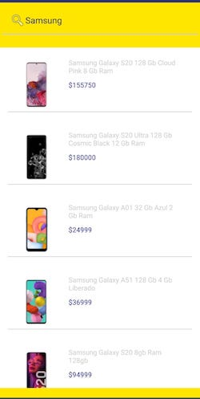

# Mercado Libre App

App for search product and show detail product with API Test Mercado Libre

## Technical information

  - Min Api Version: 22
  - Support Lansdcape and Portrait

Dependencies:

* [Dagguer] - Dependency Injection
* [Rx Java] - Asynchronous programming
* [Retrofit] - Http client
* [Butter Knife] 

## Functionalities

Search Product

Detail Product

   [Dagguer]: <https://dagger.dev/>
   [Rx Java]: <http://reactivex.io/>
   [Retrofit]: <https://square.github.io/retrofit/>
   [Butter Knife]: <https://jakewharton.github.io/butterknife/>
